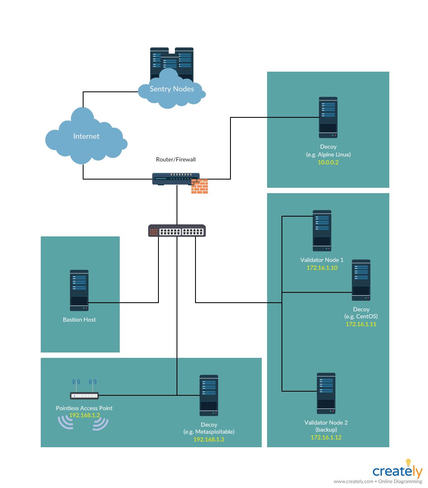

# hackatom3-secops-architecture
Architecture diagrams and any supporting Infrastructure as Code implementations 
for running a full validator setup

## Overview
Security by confusion and frustration  

The idea is to deter attackers by making the system frustrating to exploit.  
This is achieved with implementing decoys, ghosts, and honeypots in network segments.  
- Deception Toolkit (http://all.net/dtk/)
- DCEPT (https://github.com/secureworks/dcept)
- LaBrea (http://labrea.sourceforge.net/labrea-info.html)
- Metasploitable (https://github.com/rapid7/metasploitable3)

Intrusion Detection Systerm (IDS) like an IP address that is not supposed to 
have network traffic would alert to reload the infected segment with an 
uninfected snapshot, such that hacker's workflow is disrupted, and hopefully to 
the point where the hacker rage quits.

## Network diagram

## References
- Chaff Bugs: Deterring Attackers by Making Software Buggier  
https://twitter.com/polytomous/status/1025869511004577792  

- Building Virtual Pentesting Labs for Advanced Penetration Testing  
https://www.amazon.com/Building-Virtual-Pentesting-Advanced-Penetration/dp/1785883496